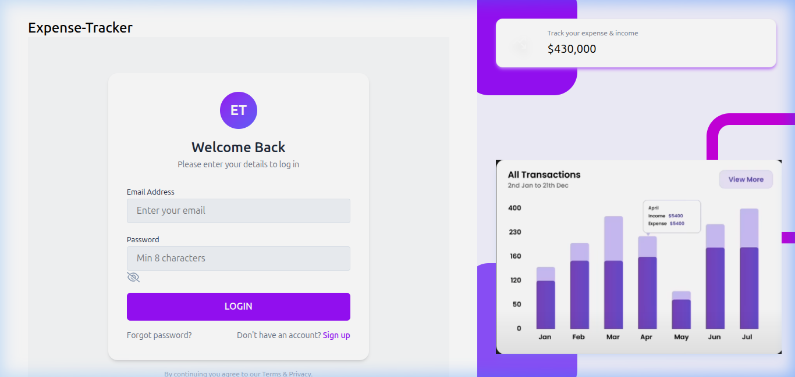

# 💰 Expense Tracker — Personal Finance Dashboard

A full-stack web application to track income & expenses with an analytics dashboard, interactive charts, and Excel report export.

🔗 **Live Demo:** [expense-tracker-p289.vercel.app](https://expense-tracker-p289.vercel.app/login)



---

## ✨ Features

- 🔐 **Secure Authentication** — JWT-based auth with bcrypt password hashing & protected routes
- 💵 **Income Tracking** — Add, view, and delete income entries with source categorization
- 💸 **Expense Tracking** — Add, view, and delete expenses with category tagging
- 📊 **Analytics Dashboard** — Real-time financial summaries powered by MongoDB aggregation pipelines
- 📈 **Interactive Charts** — Visual breakdowns using Recharts (bar charts, pie charts, trend lines)
- 📥 **Excel Export** — Download income & expense data as `.xlsx` spreadsheet reports
- 🖼️ **Profile Image Upload** — Upload and manage profile pictures with Multer
- 🎨 **Emoji Categories** — Tag transactions with emoji icons for quick visual identification
- 📱 **Responsive Design** — Works seamlessly on desktop and mobile devices

---

## 🛠️ Tech Stack

| Layer | Technologies |
|-------|-------------|
| **Frontend** | React 19, Vite, TailwindCSS 4, Recharts, React Router v7, Axios |
| **Backend** | Node.js, Express 5, Mongoose, JWT, bcryptjs, Multer, xlsx |
| **Database** | MongoDB Atlas |
| **Deployment** | Vercel (Frontend), Render (Backend) |

---

## 📁 Project Structure

```
Expense-Tracker/
├── backend/
│   ├── config/
│   │   └── db.js                  # MongoDB connection
│   ├── controller/
│   │   ├── authControler.js       # Register, Login, GetUser
│   │   ├── incomeController.js    # Income CRUD + Excel export
│   │   ├── expenseController.js   # Expense CRUD + Excel export
│   │   └── dashboardController.js # Aggregated analytics
│   ├── middleware/
│   │   ├── authMiddleware.js      # JWT verification
│   │   └── uploadMiddleware.js    # Multer file upload config
│   ├── models/
│   │   ├── User.js                # User schema with bcrypt hashing
│   │   ├── income.js              # Income schema
│   │   └── Expense.js             # Expense schema
│   ├── routes/
│   │   ├── authRoutes.js
│   │   ├── incomeRoutes.js
│   │   ├── expenseRoutes.js
│   │   └── dashboardRoutes.js
│   ├── uploads/                   # Profile image storage
│   └── server.js                  # Express entry point
│
├── frontend/
│   └── src/
│       ├── Dashboard/             # Main pages (Home, Income, Expense)
│       ├── components/            # Reusable UI components
│       ├── context/               # React Context (global state)
│       ├── hooks/                 # Custom hooks (auth guard)
│       ├── pages/                 # Auth pages (Login, SignUp)
│       ├── utils/                 # Axios config, API paths, helpers
│       └── App.jsx                # Route definitions
└── README.md
```

---

## 🔗 API Endpoints

### Authentication
| Method | Endpoint | Auth | Description |
|--------|----------|------|-------------|
| `POST` | `/api/auth/register` | ❌ | Register a new user |
| `POST` | `/api/auth/login` | ❌ | Login with email & password |
| `GET` | `/api/auth/getuser` | 🔐 | Get authenticated user profile |
| `POST` | `/api/auth/upload-image` | ❌ | Upload profile image |

### Income
| Method | Endpoint | Auth | Description |
|--------|----------|------|-------------|
| `POST` | `/api/income/add` | 🔐 | Add new income entry |
| `GET` | `/api/income/get` | 🔐 | Get all income (sorted by date) |
| `DELETE` | `/api/income/:id` | 🔐 | Delete income (ownership verified) |
| `GET` | `/api/income/download` | 🔐 | Download income as Excel file |

### Expense
| Method | Endpoint | Auth | Description |
|--------|----------|------|-------------|
| `POST` | `/api/expense/add` | 🔐 | Add new expense entry |
| `GET` | `/api/expense/get` | 🔐 | Get all expenses (sorted by date) |
| `DELETE` | `/api/expense/:id` | 🔐 | Delete expense (ownership verified) |
| `GET` | `/api/expense/download` | 🔐 | Download expenses as Excel file |

### Dashboard
| Method | Endpoint | Auth | Description |
|--------|----------|------|-------------|
| `GET` | `/api/dashboard` | 🔐 | Get aggregated financial summary |

---

## 🚀 Getting Started

### Prerequisites
- Node.js (v18+)
- MongoDB Atlas account (or local MongoDB)

### Installation

```bash
# Clone the repository
git clone https://github.com/KrishDevCrafting/Expense-Tracker-.git
cd Expense-Tracker-
```

### Backend Setup
```bash
cd backend
npm install
```

Create a `.env` file in the `/backend` directory:
```env
MONGO_URI=your_mongodb_connection_string
JWT_SECRET=your_jwt_secret_key
PORT=8080
CLIENT_URL=http://localhost:5173
```

```bash
npm run dev    # Starts server with nodemon on port 8080
```

### Frontend Setup
```bash
cd frontend
npm install
npm run dev    # Starts Vite dev server on port 5173
```

---

## 🔒 Security Features

- **Password Hashing** — bcrypt with 10 salt rounds
- **JWT Authentication** — 1-hour token expiry with Bearer scheme
- **Protected Routes** — Middleware-based route protection
- **Ownership Verification** — Users can only delete their own records
- **Axios Interceptors** — Auto-token injection & 401 redirect handling

---

## 📊 Dashboard Analytics

The dashboard uses **MongoDB aggregation pipelines** (`$match`, `$group`, `$sum`) to compute:
- Total balance (Income − Expenses)
- Total income & total expenses
- Last 30 days expense trends
- Last 60 days income trends
- Recent transactions (merged & sorted)

---

## 🔮 Future Enhancements

- [ ] Edit income/expense entries
- [ ] Monthly budget limits with alerts
- [ ] Category-wise expense breakdown charts
- [ ] Date range filters for transactions
- [ ] Recurring transaction support
- [ ] Dark mode toggle

---

## 👤 Author

**Krish** — [@KrishDevCrafting](https://github.com/KrishDevCrafting)

---

## 📄 License

This project is open source and available under the [MIT License](LICENSE).
